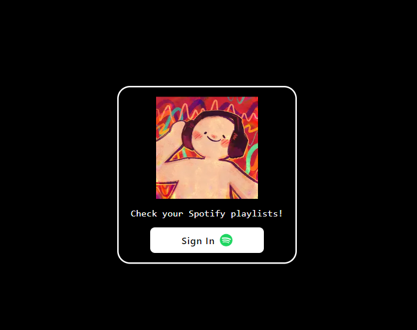
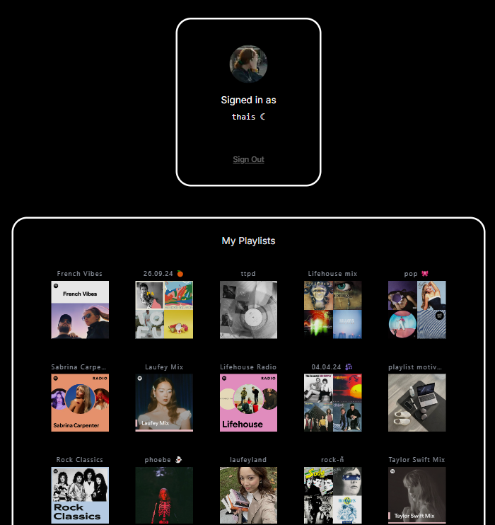
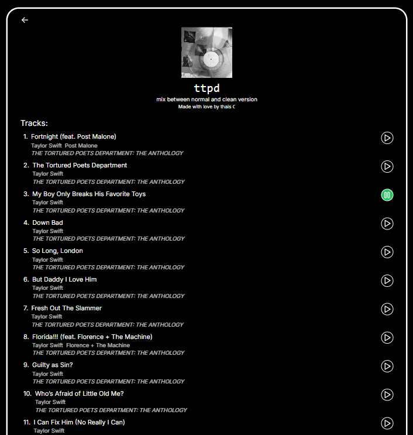

## Spotify - See my playlists







Run the development server:

```bash
yarn dev
```

Open [http://localhost:3000](http://localhost:3000) with your browser to see the result.

Log in to Spotify to see your playlists ;) and that's it!
